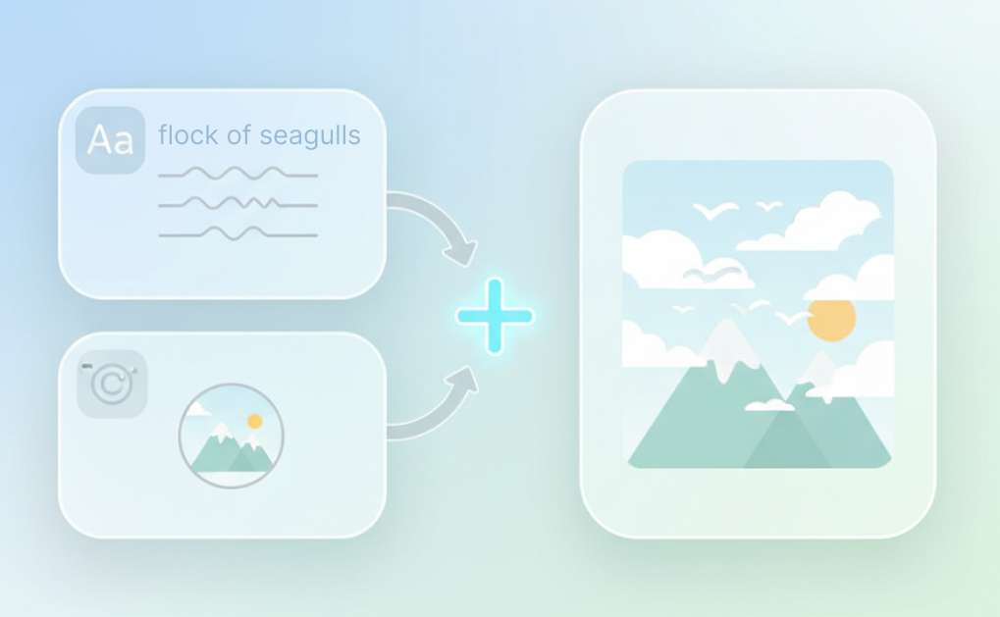
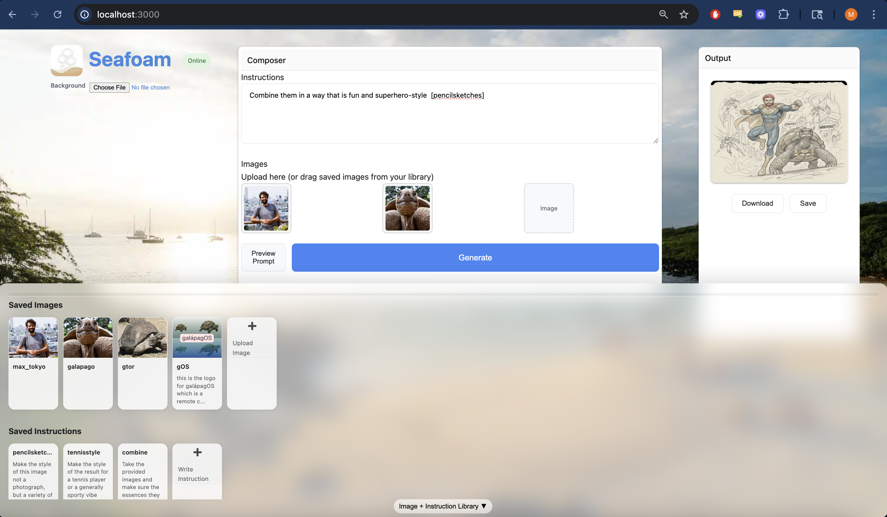

# Seafoam

## A Web App for Making Images

Seafoam lets you:

1. Combine text instructions and sample pictures into a single output image (uses Nano Banana, AKA Gemini 2.5 Flash, grom Google)

2. Save images and instructions for later use in a workspace in your browser

## Setup

1. Clone this repo and navigate to the `seafoam` directory in a terminal
2. Run `npm i` to install packages^
3. Get a Google Gemini API Key [here](https://aistudio.google.com/app/apikey) 
4. Place your API key in `.env.template` and rename the env file to `.env`
5. Start the app with `npm run dev`
6. Open `localhost:3000` in your browser